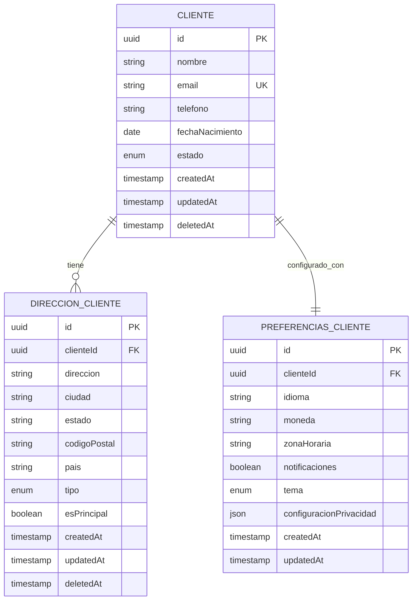

# 🏗️ Modelos de Datos y Relaciones

> 📊 Documentación completa de la estructura de datos, entidades y relaciones del MACRO Clients Microservice

## 📋 Tabla de Contenidos

- [🎯 Visión General](#-visión-general)
- [📊 Diagrama de Entidades](#-diagrama-de-entidades)
- [🏗️ Entidades Principales](#️-entidades-principales)
- [🔗 Relaciones](#-relaciones)
- [📝 Validaciones](#-validaciones)
- [🔍 Índices](#-índices)
- [💾 Configuración de Base de Datos](#-configuración-de-base-de-datos)

## 🎯 Visión General

El sistema maneja tres entidades principales que representan el core del negocio de gestión de clientes:

- 👥 **Cliente** - Información básica del cliente
- 🏠 **Dirección del Cliente** - Direcciones asociadas a cada cliente
- ⚙️ **Preferencias del Cliente** - Configuraciones personales del cliente

### 🔄 Tipos de Relaciones

- **Cliente → Direcciones**: Uno a Muchos (1:N)
- **Cliente → Preferencias**: Uno a Uno (1:1)

---

## 📊 Diagrama de Entidades



---

## 🏗️ Entidades Principales

### 👥 Cliente (clients)

Entidad principal que almacena la información básica de los clientes.

#### 📋 Estructura de Tabla

| Campo | Tipo | Obligatorio | Descripción | Ejemplo |
|-------|------|-------------|-------------|---------|
| `id` | UUID | ✅ | Identificador único | `123e4567-e89b-12d3-a456-426614174000` |
| `nombre` | VARCHAR(255) | ✅ | Nombre completo | `"Juan Carlos Pérez"` |
| `email` | VARCHAR(255) | ✅ | Email único | `"juan.perez@example.com"` |
| `telefono` | VARCHAR(20) | ❌ | Teléfono (formato internacional) | `"+52-555-1234"` |
| `fechaNacimiento` | DATE | ❌ | Fecha de nacimiento | `"1990-05-15"` |
| `estado` | ENUM | ✅ | Estado del cliente | `"activo"` |
| `createdAt` | TIMESTAMP | ✅ | Fecha de creación | `2025-09-29T10:30:00.000Z` |
| `updatedAt` | TIMESTAMP | ✅ | Última actualización | `2025-09-29T15:45:30.000Z` |
| `deletedAt` | TIMESTAMP | ❌ | Fecha de eliminación (soft delete) | `null` |

#### 🎯 Estados Válidos

```typescript
enum EstadoCliente {
  ACTIVO = 'activo',
  INACTIVO = 'inactivo',
  SUSPENDIDO = 'suspendido',
  ELIMINADO = 'eliminado'
}
```

#### 📝 Modelo TypeScript

```typescript
@Entity('clientes')
export class Cliente {
  @PrimaryGeneratedColumn('uuid')
  id: string;

  @Column({ type: 'varchar', length: 255 })
  nombre: string;

  @Column({ type: 'varchar', length: 255, unique: true })
  email: string;

  @Column({ type: 'varchar', length: 20, nullable: true })
  telefono?: string;

  @Column({ type: 'date', nullable: true })
  fechaNacimiento?: Date;

  @Column({
    type: 'enum',
    enum: EstadoCliente,
    default: EstadoCliente.ACTIVO
  })
  estado: EstadoCliente;

  @CreateDateColumn()
  createdAt: Date;

  @UpdateDateColumn()
  updatedAt: Date;

  @DeleteDateColumn()
  deletedAt?: Date;

  // Relaciones
  @OneToMany(() => DireccionCliente, direccion => direccion.cliente)
  direcciones: DireccionCliente[];

  @OneToOne(() => PreferenciasCliente, preferencias => preferencias.cliente)
  @JoinColumn()
  preferencias?: PreferenciasCliente;
}
```

#### 🔍 GraphQL Schema

```graphql
type Client {
  id: ID!
  nombre: String!
  email: String!
  telefono: String
  fechaNacimiento: Date
  estado: EstadoCliente!
  createdAt: DateTime!
  updatedAt: DateTime!
  
  # Relaciones
  direcciones: [ClientAddress!]!
  preferencias: ClientPreferences
}

enum EstadoCliente {
  ACTIVO
  INACTIVO
  SUSPENDIDO
  ELIMINADO
}
```

---

### 🏠 Dirección del Cliente (direcciones_cliente)

Almacena las direcciones asociadas a cada cliente.

#### 📋 Estructura de Tabla

| Campo | Tipo | Obligatorio | Descripción | Ejemplo |
|-------|------|-------------|-------------|---------|
| `id` | UUID | ✅ | Identificador único | `addr-123e4567-e89b-12d3` |
| `clienteId` | UUID | ✅ | Referencia al cliente | `123e4567-e89b-12d3-a456` |
| `direccion` | TEXT | ✅ | Dirección completa | `"Av. Reforma 123, Col. Centro"` |
| `ciudad` | VARCHAR(100) | ✅ | Ciudad | `"Ciudad de México"` |
| `estado` | VARCHAR(100) | ❌ | Estado/Provincia | `"CDMX"` |
| `codigoPostal` | VARCHAR(10) | ❌ | Código postal | `"06000"` |
| `pais` | VARCHAR(100) | ✅ | País | `"México"` |
| `tipo` | ENUM | ✅ | Tipo de dirección | `"casa"` |
| `esPrincipal` | BOOLEAN | ✅ | Es dirección principal | `true` |
| `createdAt` | TIMESTAMP | ✅ | Fecha de creación | `2025-09-29T10:30:00.000Z` |
| `updatedAt` | TIMESTAMP | ✅ | Última actualización | `2025-09-29T15:45:30.000Z` |
| `deletedAt` | TIMESTAMP | ❌ | Fecha de eliminación | `null` |

#### 🏷️ Tipos de Dirección

```typescript
enum TipoDireccion {
  CASA = 'casa',
  TRABAJO = 'trabajo',
  FACTURACION = 'facturacion',
  ENVIO = 'envio',
  OTRO = 'otro'
}
```

#### 📝 Modelo TypeScript

```typescript
@Entity('direcciones_cliente')
export class DireccionCliente {
  @PrimaryGeneratedColumn('uuid')
  id: string;

  @Column({ type: 'uuid' })
  clienteId: string;

  @Column({ type: 'text' })
  direccion: string;

  @Column({ type: 'varchar', length: 100 })
  ciudad: string;

  @Column({ type: 'varchar', length: 100, nullable: true })
  estado?: string;

  @Column({ type: 'varchar', length: 10, nullable: true })
  codigoPostal?: string;

  @Column({ type: 'varchar', length: 100 })
  pais: string;

  @Column({
    type: 'enum',
    enum: TipoDireccion,
    default: TipoDireccion.CASA
  })
  tipo: TipoDireccion;

  @Column({ type: 'boolean', default: false })
  esPrincipal: boolean;

  @CreateDateColumn()
  createdAt: Date;

  @UpdateDateColumn()
  updatedAt: Date;

  @DeleteDateColumn()
  deletedAt?: Date;

  // Relaciones
  @ManyToOne(() => Cliente, cliente => cliente.direcciones, {
    onDelete: 'CASCADE'
  })
  @JoinColumn({ name: 'clienteId' })
  cliente: Cliente;
}
```

#### 🔍 GraphQL Schema

```graphql
type ClientAddress {
  id: ID!
  direccion: String!
  ciudad: String!
  estado: String
  codigoPostal: String
  pais: String!
  tipo: TipoDireccion!
  esPrincipal: Boolean!
  createdAt: DateTime!
  updatedAt: DateTime!
  
  # Relaciones
  cliente: Client!
}

enum TipoDireccion {
  CASA
  TRABAJO
  FACTURACION
  ENVIO
  OTRO
}
```

---

### ⚙️ Preferencias del Cliente (preferencias_cliente)

Configuraciones personales y preferencias de cada cliente.

#### 📋 Estructura de Tabla

| Campo | Tipo | Obligatorio | Descripción | Ejemplo |
|-------|------|-------------|-------------|---------|
| `id` | UUID | ✅ | Identificador único | `pref-123e4567-e89b` |
| `clienteId` | UUID | ✅ | Referencia al cliente | `123e4567-e89b-12d3-a456` |
| `idioma` | VARCHAR(5) | ✅ | Código de idioma | `"es"` |
| `moneda` | VARCHAR(3) | ✅ | Código de moneda | `"MXN"` |
| `zonaHoraria` | VARCHAR(50) | ❌ | Zona horaria | `"America/Mexico_City"` |
| `notificaciones` | BOOLEAN | ✅ | Recibir notificaciones | `true` |
| `tema` | ENUM | ✅ | Tema de la interfaz | `"claro"` |
| `configuracionPrivacidad` | JSON | ❌ | Configuración de privacidad | `{"compartirDatos": false}` |
| `createdAt` | TIMESTAMP | ✅ | Fecha de creación | `2025-09-29T10:30:00.000Z` |
| `updatedAt` | TIMESTAMP | ✅ | Última actualización | `2025-09-29T15:45:30.000Z` |

#### 🎨 Opciones de Configuración

```typescript
// Idiomas soportados
enum Idioma {
  ESPANOL = 'es',
  INGLES = 'en',
  FRANCES = 'fr',
  PORTUGUES = 'pt'
}

// Monedas soportadas
enum Moneda {
  PESO_MEXICANO = 'MXN',
  DOLAR_ESTADOUNIDENSE = 'USD',
  EURO = 'EUR',
  DOLAR_CANADIENSE = 'CAD'
}

// Temas de interfaz
enum Tema {
  CLARO = 'claro',
  OSCURO = 'oscuro',
  AUTOMATICO = 'auto'
}

// Configuración de privacidad
interface ConfiguracionPrivacidad {
  compartirDatos: boolean;
  recibirMarketing: boolean;
  perfilPublico: boolean;
  cookies: {
    esenciales: boolean;
    analiticas: boolean;
    marketing: boolean;
  };
}
```

#### 📝 Modelo TypeScript

```typescript
@Entity('preferencias_cliente')
export class PreferenciasCliente {
  @PrimaryGeneratedColumn('uuid')
  id: string;

  @Column({ type: 'uuid', unique: true })
  clienteId: string;

  @Column({ type: 'varchar', length: 5, default: 'es' })
  idioma: string;

  @Column({ type: 'varchar', length: 3, default: 'MXN' })
  moneda: string;

  @Column({ type: 'varchar', length: 50, nullable: true })
  zonaHoraria?: string;

  @Column({ type: 'boolean', default: true })
  notificaciones: boolean;

  @Column({
    type: 'enum',
    enum: Tema,
    default: Tema.CLARO
  })
  tema: Tema;

  @Column({ type: 'json', nullable: true })
  configuracionPrivacidad?: ConfiguracionPrivacidad;

  @CreateDateColumn()
  createdAt: Date;

  @UpdateDateColumn()
  updatedAt: Date;

  // Relaciones
  @OneToOne(() => Cliente, cliente => cliente.preferencias, {
    onDelete: 'CASCADE'
  })
  @JoinColumn({ name: 'clienteId' })
  cliente: Cliente;
}
```

#### 🔍 GraphQL Schema

```graphql
type ClientPreferences {
  id: ID!
  idioma: String!
  moneda: String!
  zonaHoraria: String
  notificaciones: Boolean!
  tema: Tema!
  configuracionPrivacidad: JSON
  createdAt: DateTime!
  updatedAt: DateTime!
  
  # Relaciones
  cliente: Client!
}

enum Tema {
  CLARO
  OSCURO
  AUTOMATICO
}
```

---

## 🔗 Relaciones

### 🔄 Cliente → Direcciones (1:N)

Un cliente puede tener múltiples direcciones, pero cada dirección pertenece a un solo cliente.

```typescript
// En Cliente
@OneToMany(() => DireccionCliente, direccion => direccion.cliente, {
  cascade: true,
  eager: false
})
direcciones: DireccionCliente[];

// En DireccionCliente
@ManyToOne(() => Cliente, cliente => cliente.direcciones, {
  onDelete: 'CASCADE'
})
cliente: Cliente;
```

**Reglas de Negocio:**
- ✅ Un cliente puede tener 0 o más direcciones
- ✅ Solo una dirección puede ser principal (`esPrincipal = true`)
- ✅ Al eliminar un cliente, se eliminan todas sus direcciones (CASCADE)
- ✅ Al crear la primera dirección, automáticamente se marca como principal

### 🔄 Cliente → Preferencias (1:1)

Cada cliente tiene exactamente una configuración de preferencias.

```typescript
// En Cliente
@OneToOne(() => PreferenciasCliente, preferencias => preferencias.cliente, {
  cascade: true,
  eager: true
})
preferencias?: PreferenciasCliente;

// En PreferenciasCliente
@OneToOne(() => Cliente, cliente => cliente.preferencias, {
  onDelete: 'CASCADE'
})
cliente: Cliente;
```

**Reglas de Negocio:**
- ✅ Cada cliente puede tener 0 o 1 configuración de preferencias
- ✅ Las preferencias se crean con valores por defecto si no se especifican
- ✅ Al eliminar un cliente, se eliminan sus preferencias (CASCADE)

---

## 📝 Validaciones

### 👥 Validaciones de Cliente

```typescript
import { IsEmail, IsNotEmpty, IsOptional, IsPhoneNumber, IsDateString } from 'class-validator';

export class CreateClientInput {
  @IsNotEmpty({ message: 'El nombre es requerido' })
  @Length(2, 255, { message: 'El nombre debe tener entre 2 y 255 caracteres' })
  nombre: string;

  @IsEmail({}, { message: 'Debe ser un email válido' })
  @IsNotEmpty({ message: 'El email es requerido' })
  email: string;

  @IsOptional()
  @IsPhoneNumber(null, { message: 'Debe ser un número de teléfono válido' })
  telefono?: string;

  @IsOptional()
  @IsDateString({}, { message: 'Debe ser una fecha válida (YYYY-MM-DD)' })
  fechaNacimiento?: string;
}
```

### 🏠 Validaciones de Dirección

```typescript
export class CreateClientAddressInput {
  @IsUUID(4, { message: 'clienteId debe ser un UUID válido' })
  clienteId: string;

  @IsNotEmpty({ message: 'La dirección es requerida' })
  @Length(5, 500, { message: 'La dirección debe tener entre 5 y 500 caracteres' })
  direccion: string;

  @IsNotEmpty({ message: 'La ciudad es requerida' })
  @Length(2, 100, { message: 'La ciudad debe tener entre 2 y 100 caracteres' })
  ciudad: string;

  @IsOptional()
  @Length(2, 100)
  estado?: string;

  @IsOptional()
  @Matches(/^[0-9]{4,10}$/, { message: 'Código postal inválido' })
  codigoPostal?: string;

  @IsNotEmpty({ message: 'El país es requerido' })
  @Length(2, 100, { message: 'El país debe tener entre 2 y 100 caracteres' })
  pais: string;

  @IsEnum(TipoDireccion, { message: 'Tipo de dirección inválido' })
  tipo: TipoDireccion;

  @IsOptional()
  @IsBoolean()
  esPrincipal?: boolean;
}
```

### ⚙️ Validaciones de Preferencias

```typescript
export class CreateClientPreferencesInput {
  @IsUUID(4, { message: 'clienteId debe ser un UUID válido' })
  clienteId: string;

  @IsOptional()
  @IsIn(['es', 'en', 'fr', 'pt'], { message: 'Idioma no soportado' })
  idioma?: string;

  @IsOptional()
  @IsIn(['MXN', 'USD', 'EUR', 'CAD'], { message: 'Moneda no soportada' })
  moneda?: string;

  @IsOptional()
  @IsTimeZone({ message: 'Zona horaria inválida' })
  zonaHoraria?: string;

  @IsOptional()
  @IsBoolean()
  notificaciones?: boolean;

  @IsOptional()
  @IsEnum(Tema, { message: 'Tema inválido' })
  tema?: Tema;
}
```

---

## 🔍 Índices

### 📊 Índices para Rendimiento

```sql
-- Cliente
CREATE UNIQUE INDEX idx_clientes_email ON clientes(email) WHERE deleted_at IS NULL;
CREATE INDEX idx_clientes_estado ON clientes(estado);
CREATE INDEX idx_clientes_created_at ON clientes(created_at);
CREATE INDEX idx_clientes_deleted_at ON clientes(deleted_at);

-- Dirección Cliente
CREATE INDEX idx_direcciones_cliente_id ON direcciones_cliente(cliente_id);
CREATE INDEX idx_direcciones_es_principal ON direcciones_cliente(es_principal) WHERE es_principal = true;
CREATE INDEX idx_direcciones_tipo ON direcciones_cliente(tipo);
CREATE INDEX idx_direcciones_ciudad ON direcciones_cliente(ciudad);
CREATE INDEX idx_direcciones_pais ON direcciones_cliente(pais);

-- Preferencias Cliente
CREATE UNIQUE INDEX idx_preferencias_cliente_id ON preferencias_cliente(cliente_id);
CREATE INDEX idx_preferencias_idioma ON preferencias_cliente(idioma);
CREATE INDEX idx_preferencias_moneda ON preferencias_cliente(moneda);
```

### 🚀 Consultas Optimizadas

```typescript
// Buscar clientes por email (único)
const client = await clientRepository.findOne({
  where: { email, deletedAt: IsNull() }
});

// Buscar direcciones principales
const mainAddresses = await addressRepository.find({
  where: { esPrincipal: true },
  relations: ['cliente']
});

// Buscar clientes por ciudad
const clientsInCity = await clientRepository
  .createQueryBuilder('cliente')
  .innerJoin('cliente.direcciones', 'direccion')
  .where('direccion.ciudad = :ciudad', { ciudad })
  .andWhere('cliente.deletedAt IS NULL')
  .getMany();
```

---

## 💾 Configuración de Base de Datos

### 🐘 PostgreSQL Setup

```sql
-- Crear base de datos
CREATE DATABASE macro_clients_db;

-- Crear usuario
CREATE USER macro_user WITH PASSWORD 'secure_password';

-- Otorgar permisos
GRANT ALL PRIVILEGES ON DATABASE macro_clients_db TO macro_user;

-- Conectar a la base de datos
\c macro_clients_db;

-- Habilitar extensiones
CREATE EXTENSION IF NOT EXISTS "uuid-ossp";
CREATE EXTENSION IF NOT EXISTS "pg_trgm";
```

### ⚙️ TypeORM Configuration

```typescript
export const typeOrmConfig: TypeOrmModuleOptions = {
  type: 'postgres',
  host: process.env.DB_HOST || 'localhost',
  port: parseInt(process.env.DB_PORT) || 5432,
  username: process.env.DB_USERNAME || 'macro_user',
  password: process.env.DB_PASSWORD || 'secure_password',
  database: process.env.DB_NAME || 'macro_clients_db',
  
  // Entidades
  entities: [Cliente, DireccionCliente, PreferenciasCliente],
  
  // Configuraciones de desarrollo
  synchronize: process.env.NODE_ENV === 'development',
  logging: process.env.NODE_ENV === 'development',
  
  // Pool de conexiones
  extra: {
    connectionLimit: 10,
    acquireTimeout: 60000,
    timeout: 60000,
  },
  
  // Configuración SSL para producción
  ssl: process.env.NODE_ENV === 'production' ? {
    rejectUnauthorized: false
  } : false
};
```

### 📊 Configuración de Migrations

```typescript
// ormconfig.ts para migrations
export default {
  type: 'postgres',
  host: process.env.DB_HOST,
  port: process.env.DB_PORT,
  username: process.env.DB_USERNAME,
  password: process.env.DB_PASSWORD,
  database: process.env.DB_NAME,
  
  entities: ['src/**/*.entity.ts'],
  migrations: ['src/migrations/*.ts'],
  cli: {
    migrationsDir: 'src/migrations'
  },
  
  synchronize: false, // Siempre false en producción
  logging: ['error', 'warn'],
};
```

---

## 📋 Comandos Útiles

### 🛠️ Gestión de Base de Datos

```bash
# Generar migración
npm run typeorm:migration:generate -- -n CreateClientTables

# Ejecutar migraciones
npm run typeorm:migration:run

# Revertir migración
npm run typeorm:migration:revert

# Sincronizar esquema (solo desarrollo)
npm run typeorm:schema:sync

# Eliminar esquema
npm run typeorm:schema:drop
```

### 📊 Scripts de Seeds

```bash
# Ejecutar seeds completos
npm run seeds

# Ejecutar seeds específicos
curl -X POST http://localhost:3000/seeds

# Verificar datos creados
npm run typeorm:query -- "SELECT COUNT(*) FROM clientes"
```

---

## 🚨 Consideraciones Importantes

### 🔒 Seguridad

- ✅ **Soft Delete**: Los clientes nunca se eliminan físicamente, solo se marca `deletedAt`
- ✅ **Email único**: Cada email solo puede estar asociado a un cliente activo
- ✅ **Validación de datos**: Todas las entradas se validan antes del guardado
- ✅ **Índices optimizados**: Para consultas rápidas y eficientes

### 🚀 Rendimiento

- ✅ **Paginación**: Todas las consultas de listado usan paginación
- ✅ **Eager loading**: Las relaciones se cargan bajo demanda
- ✅ **Connection pooling**: Pool de conexiones configurado para concurrencia
- ✅ **Índices estratégicos**: En campos más consultados

### 📈 Escalabilidad

- ✅ **UUID como PK**: Permite sharding horizontal
- ✅ **JSON para configuraciones**: Flexibilidad en preferencias
- ✅ **Estructura normalizada**: Fácil mantenimiento y extensión

---

## 📞 Soporte

Para preguntas sobre el modelo de datos:

- 📧 **Email:** architecture@macro.com
- 💬 **Slack:** #database-design
- 📚 **Wiki:** [Database Documentation](https://wiki.macro.com/database)

---

⭐ **¡Los modelos están diseñados para ser flexibles y escalables!**